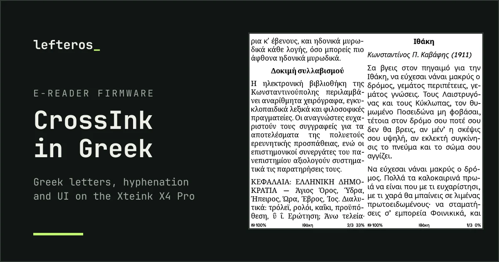
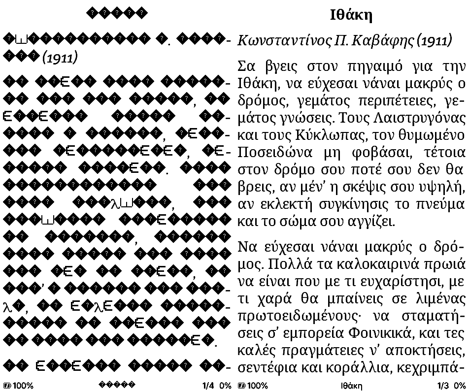
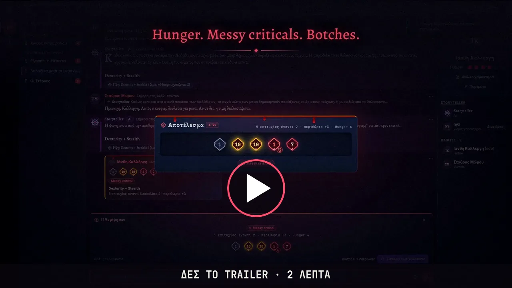
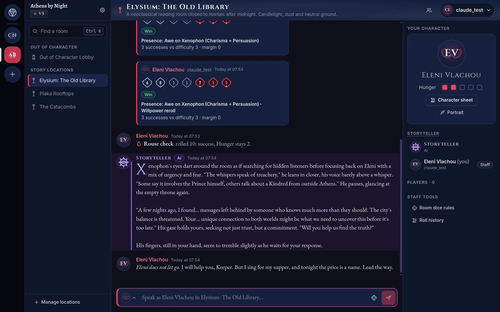
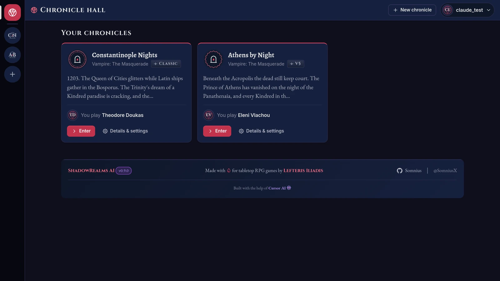
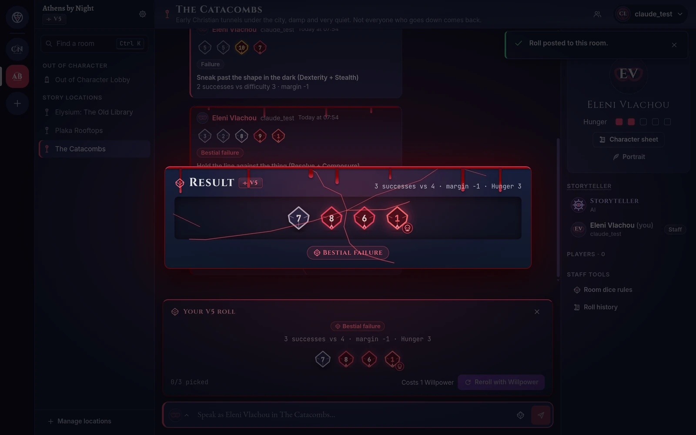
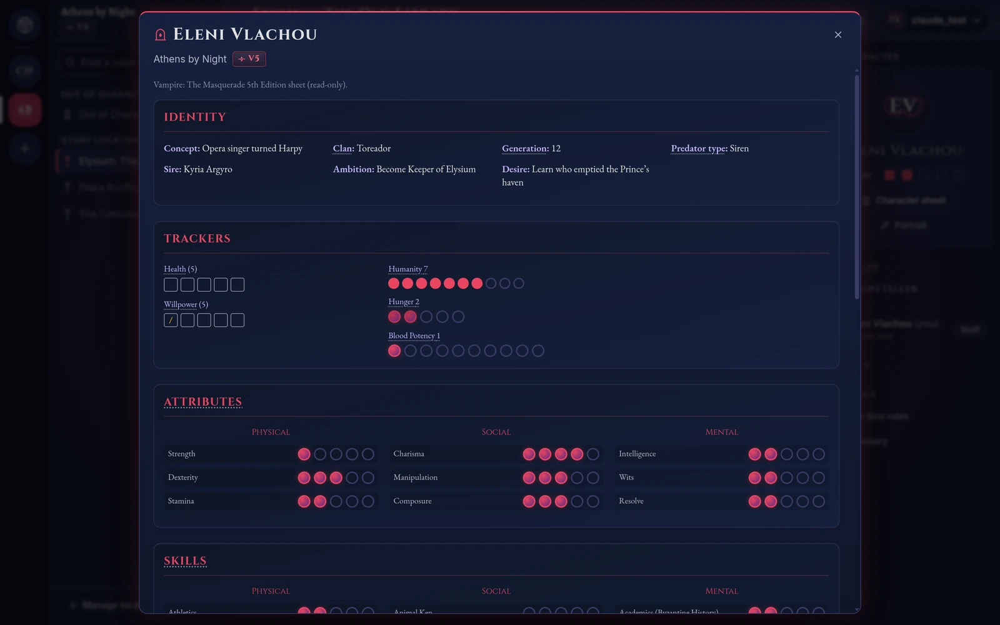
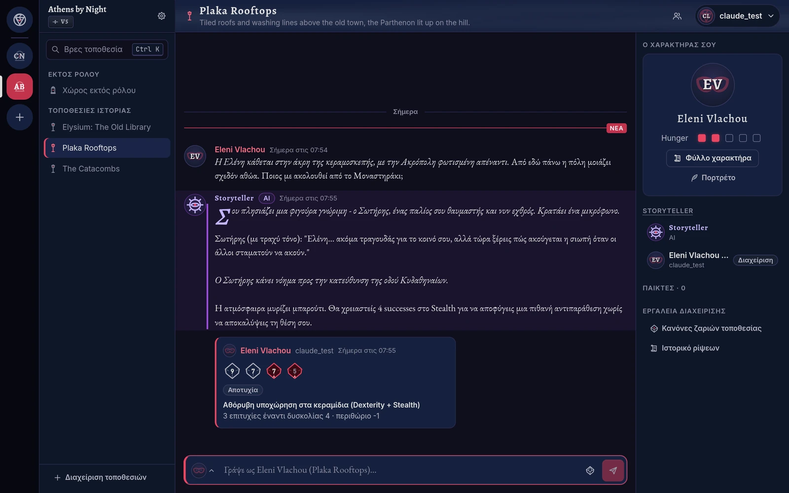
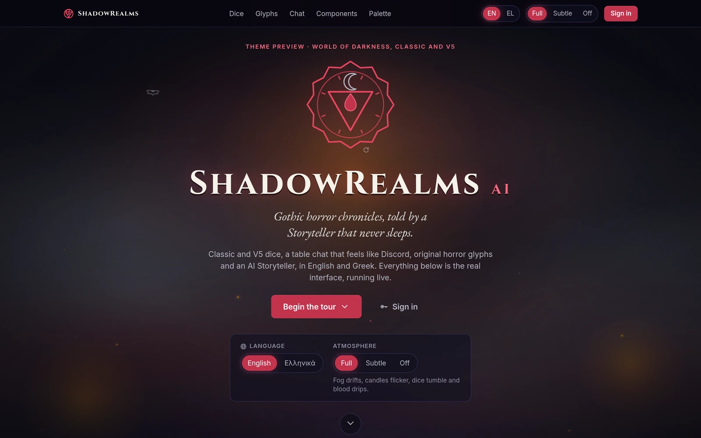
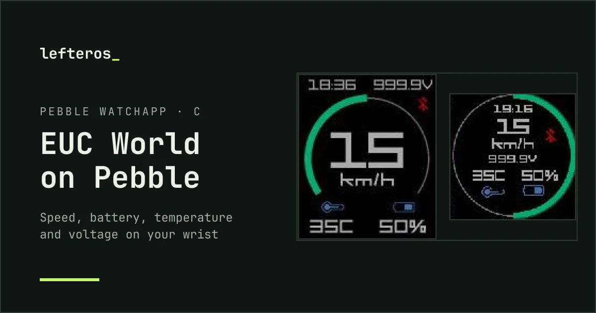

  <a href="README.md">🇬🇧 English</a> · <b>🇬🇷 Ελληνικά</b>

  
  
  
  
  

## Γεια, είμαι ο Λευτέρης, ή απλά Lef

Ένας φίλος μου έβαλε **Red Hat** στον υπολογιστή το 1997 και από τότε δεν σταμάτησα να σκαλίζω. Τη μέρα κρατάω όρθιους τους servers και το ERP επιχειρήσεων· τον υπόλοιπο χρόνο φτιάχνω πράγματα με ό,τι καινούργιο βγαίνει: τελευταία, AI που τρέχει στο δικό σου μηχάνημα και plugins για το [Omarchy](https://omarchy.org). Στα φόρουμ και σχεδόν παντού αλλού γράφω ως **SomniusX**.

Ό,τι φτιάχνω, γράφω και έχω δουλέψει βρίσκεται στο **[lefteros_ · lefteros.com](https://lefteros.com/)**: οι [δημιουργίες](https://lefteros.com/apps/), οι [οδηγοί και τα άρθρα](https://lefteros.com/blog/), [όλη η ιστορία](https://lefteros.com/about/) και [πού αλλού θα με βρεις](https://lefteros.com/presence/). Εδώ είναι η σύντομη εκδοχή.

## Τελευταίο έργο: CrossInk στα ελληνικά

Το **CrossInk** είναι ανοιχτό firmware (MIT) για τις μικρές συσκευές ανάγνωσης e-ink της **Xteink**. Μέχρι τώρα δεν «μιλούσε» ελληνικά: τα ελληνικά βιβλία έβγαιναν ως ◆ κουτάκια, και ούτε το μενού ούτε ο συλλαβισμός ήξεραν τη γλώσσα. Έφτιαξα την ελληνική υποστήριξη σε λιγότερο από 24 ώρες, και κυκλοφορεί ως δοκιμαστική έκδοση για το **Xteink X4 Pro**.

- **Ελληνικά στις γραμματοσειρές ανάγνωσης.** Η Bitter και η Lexend Deca δεν έχουν ελληνικά, οπότε δίπλα τους μπαίνουν ελληνικά υποσύνολα της Noto Serif και της Noto Sans, σε όλα τα στυλ.
- **Ελληνικός συλλαβισμός.** Με πλήρη στοίχιση οι λέξεις κόβονται σωστά: κα-λη-μέ-ρα, ηλε-κτρο-νι-κός, προ-ϋ-πό-θε-ση.
- **Ελληνικό μενού.** Μεταφρασμένα και τα 843 κείμενα της διεπαφής.
- **Ελληνικοί τίτλοι παντού.** Η αρχική οθόνη, οι περιγραφές και οι σημειώσεις δείχνουν σωστά ελληνικούς τίτλους και συγγραφείς, ακόμη και με αγγλικό μενού.
- **Χωράει με άνεση.** Χωρίς τα βιετναμέζικα και τα αραβικά, η ελληνική έκδοση βγαίνει περίπου 57 KB μικρότερη από το επίσημο 1.6.0.

 
Η <i>Ιθάκη</i> του Καβάφη στη Bitter: αριστερά το επίσημο 1.6.0, δεξιά η ελληνική έκδοση.

**[Η σελίδα της εφαρμογής στο lefteros.com →](https://lefteros.com/apps/crossink-greek/)** · **[Πώς φτιάχτηκε, βήμα βήμα →](https://lefteros.com/blog/crossink-greek/)**
 [Κατέβασε το v1.6.0-greek2 για το X4 Pro](https://github.com/Somnius/CrossInk/releases) · [Η πρόταση στο CrossInk (#789)](https://github.com/uxjulia/CrossInk/discussions/789) · beta

## Γλώσσες και εργαλεία

   
  

Επίσης: Proxmox · ESXi · KVM · MikroTik · Synology · Microsoft 365 · MS SQL · Semantic · Cubit · Soft1 · Singular / Epsilon · whisper.cpp · llama.cpp · Ollama · ChromaDB · MCP

## Ναυαρχίδα: ShadowRealms AI

Το **[ShadowRealms AI](https://github.com/Somnius/shadowrealms-ai)** είναι ένας AI Storyteller για χρονικά World of Darkness, που τον φιλοξενείς μόνος σου. Τρέχει σε Docker, οι ιστορίες βγαίνουν από τοπικά μοντέλα μέσω LM Studio και Ollama, και κάθε χρονικό παίζεται με τους κανόνες **Classic** (oWoD Revised: Vampire, Werewolf, Mage) ή **V5**, στα αγγλικά ή στα ελληνικά. Είναι το μεγαλύτερο έργο μου.

 
<b><a href="https://github.com/Somnius/shadowrealms-ai/releases/download/trailer-v0.10.0/trailer_el_1080p60.mp4">Το trailer στα ελληνικά</a></b> · <b><a href="https://github.com/Somnius/shadowrealms-ai/releases/download/trailer-v0.10.0/trailer_en_1080p60.mp4">Trailer in English</a></b> · 2 λεπτά, γυρισμένο σε καινούργια εγκατάσταση: αληθινές απαντήσεις του Storyteller από τοπικό μοντέλο, αληθινές ζαριές, πρωτότυπη μουσική.

- **Δύο συστήματα κανόνων.** Τα ζάρια του Classic ακολουθούν το Revised (δυσκολίες, botch, ειδικότητες, Willpower). Το V5 φέρνει ζάρια Hunger, messy criticals, bestial failures και Rouse checks.
- **Ζάρια από το φύλλο σου.** Όταν ο Storyteller ζητά ζαριά, ο server υπολογίζει τα ζάρια από το φύλλο χαρακτήρα σου, και κάθε κάρτα ζαριάς στη συζήτηση είναι αληθινή ζαριά του server.
- **Παιχνίδι σαν στο Discord.** Δωμάτια μέσα και έξω από τον χαρακτήρα, ζωντανές ενημερώσεις, εντολές με κάθετο και δημιουργία χαρακτήρα για κάθε έκδοση.
- **AI σε ρόλους.** Storyteller στα αγγλικά και στα ελληνικά (Llama-Krikri για τα ελληνικά), μακροπρόθεσμη μνήμη και αναζήτηση στα βιβλία κανόνων με bge-m3 στην ChromaDB, και ο ταξινομητής Laya που επιβλέπει τα δωμάτια OOC.
- **Γοτθική αισθητική.** 97 πρωτότυπα σύμβολα και σφραγίδες σε SVG, κινούμενα ζάρια, ομίχλη, φως κεριού και αίμα σε κάθε botch.
- **Νέα μηχανή στην 0.10.0.** Vite στη θέση του Create React App (build σε περίπου ένα δευτερόλεπτο, το npm audit από 69 ευρήματα σε 0), React Router 7, Python 3.12, κλειδωμένη έκδοση ChromaDB και καμία προειδοποίηση lint.

<table>
<tr>
<td width="33%" valign="top"> Ένα χρονικό V5 σε εξέλιξη</td>
<td width="33%" valign="top"> Η αίθουσα των χρονικών</td>
<td width="33%" valign="top"> Ένα bestial failure</td>
</tr>
<tr>
<td width="33%" valign="top"> Φύλλο χαρακτήρα V5</td>
<td width="33%" valign="top"> Παιχνίδι στα ελληνικά</td>
<td width="33%" valign="top"> Η προεπισκόπηση του θέματος</td>
</tr>
</table>

  · **[Η ιστορία του στο lefteros.com →](https://lefteros.com/apps/shadowrealms-ai/)**

## Plugins για το Omarchy

Το Omarchy είναι το στήσιμο Arch + Hyprland που δοκιμάζουν όλοι αυτή τη στιγμή. Φτιάχνω plugins για την μπάρα του και έχω ανοίξει [pull request](https://github.com/basecamp/omarchy/pull/4230) για υποστήριξη Libreboot / Coreboot.

<table>
<tr>
<td width="50%" valign="top">

<b><a href="https://github.com/Somnius/Windows-VM-for-Omarchy">Windows VM for Omarchy</a></b> 
Σύνδεση χωρίς κωδικό, RDP που ξανασυνδέεται μόνο του, ζωντανά γραφήματα CPU, μνήμης, δίσκου και δικτύου. 
<a href="https://lefteros.com/apps/omarchy-windows-vm/">Στο lefteros.com →</a>
</td>
<td width="50%" valign="top">

<b><a href="https://github.com/Somnius/Keyboard-Layout-for-Omarchy">Keyboard Layout for Omarchy</a></b>  
Ένδειξη διάταξης πληκτρολογίου στην μπάρα: εναλλαγή, οποιοδήποτε ζεύγος xkb, λυχνία Caps. 
<a href="https://lefteros.com/apps/omarchy-keyboard-layout/">Στο lefteros.com →</a>
</td>
</tr>
<tr>
<td width="50%" valign="top">

<b><a href="https://github.com/Somnius/Messaging-for-Omarchy">Messaging for Omarchy</a></b> 
Slack, Discord, Telegram και WhatsApp Web σε δικά τους παράθυρα, το καθένα με απομονωμένο προφίλ. 
<a href="https://lefteros.com/apps/omarchy-messaging/">Στο lefteros.com →</a>
</td>
<td width="50%" valign="top">

<b><a href="https://github.com/Somnius/Password-Store-for-Omarchy">Password Store for Omarchy</a></b> 
Το vault σου στο Bitwarden, Vaultwarden, 1Password ή LastPass σε δικό του παράθυρο. Δεν αποθηκεύει κωδικούς. 
<a href="https://lefteros.com/apps/omarchy-password-store/">Στο lefteros.com →</a>
</td>
</tr>
<tr>
<td width="50%" valign="top">

<b><a href="https://github.com/Somnius/Omarchy-Wallpaper-Rotate">Wallpaper Rotate</a></b> 
Εναλλαγή ταπετσαριών από τους δικούς σου φακέλους με πρόγραμμα, εικονίδιο στην μπάρα και πάνελ. 
<a href="https://lefteros.com/apps/omarchy-wallpaper-rotate/">Στο lefteros.com →</a>
</td>
<td width="50%" valign="top">

<b><a href="https://github.com/Somnius/serpantinum-omarchy">Serpantinum for Omarchy</a></b>  
Τα widgets του Serpantinum στο Omarchy: <a href="https://github.com/Somnius/serpantinum-omarchy-calendar">ημερολόγιο</a>, <a href="https://github.com/Somnius/serpantinum-omarchy-power">ενέργεια</a>, <a href="https://github.com/Somnius/serpantinum-omarchy-media">πολυμέσα</a> και <a href="https://github.com/Somnius/serpantinum-omarchy-bluetooth">Bluetooth</a>.
</td>
</tr>
</table>

## Εργαλεία και τοπική AI

<table>
<tr>
<td width="50%" valign="top">

<b><a href="https://github.com/Somnius/virt-spinner">virt-spinner</a></b>  
TUI για libvirt, QEMU και KVM, με πληκτρολόγιο: πιο ελαφρύ από το GNOME Boxes και το virt-manager, και δουλεύει μέσω SSH.
</td>
<td width="50%" valign="top">

<b><a href="https://github.com/Somnius/VoxTyper">VoxTyper</a></b>  
Υπαγόρευση χωρίς σύνδεση για Arch + Hyprland και Fedora KDE σε Wayland, με το whisper.cpp. 
<a href="https://lefteros.com/blog/linux-user-6142/">Ο οδηγός στο lefteros.com →</a>
</td>
</tr>
<tr>
<td width="50%" valign="top">

<b><a href="https://github.com/Somnius/Claudius-Bootstrapper">Claudius-Bootstrapper</a></b>  
Τα δικά σου μοντέλα από το LM Studio (ή όποιο συμβατό endpoint) μέσα στο Claude Code, στο τερματικό ή σε fork του VS Code.
</td>
<td width="50%" valign="top">

<b><a href="https://github.com/Somnius/EucWorldPebble">EucWorldPebble</a></b>  
Εφαρμογή για ρολόι Pebble που συνεργάζεται με το EUC World για ηλεκτρικά μονόκυκλα. Δείχνει στον καρπό σου ταχύτητα, μπαταρία, θερμοκρασία, τάση και ρεύμα. Έχει δύο όψεις, Ρεύμα &amp; Τάση και Ώρα &amp; Τάση με μεγάλο δείκτη ταχύτητας, και τρέχει σε κάθε Pebble, και στα στρογγυλά. Τη φτιάξαμε με τον Alex Kintis πάνω στο WheelLogPebble. 
<a href="https://github.com/Somnius/EucWorldPebble/releases">Κατέβασε το .pbw →</a>
</td>
</tr>
<tr>
<td width="50%" valign="top">

<b><a href="https://github.com/Somnius/local-mobile-llm-mcp">local-mobile-llm-mcp</a></b> 
Τοπικά LLM στο κινητό με εργαλεία MCP (αναζήτηση, αρχεία, βάσεις δεδομένων), χωρίς υπηρεσίες cloud.
</td>
<td width="50%" valign="top">

<b><a href="https://lefteros.com/apps/recmeets/">RecMeets</a></b> · <i>σύντομα</i> 
Καταγραφή συσκέψεων σε δύο κανάλια με τοπική απομαγνητοφώνηση, ομιλητές και κεφάλαια. Rust, whisper.cpp, ONNX Runtime. 
<a href="https://lefteros.com/apps/recmeets/">Στο lefteros.com →</a>
</td>
</tr>
</table>

<b>Περισσότερα δημόσια repos από τα χρόνια που πέρασαν</b>

 

| Repo | Τι κάνει |
|---|---|
| [MiFlash-for-Mac](https://github.com/Somnius/MiFlash-for-Mac) | Flashing κινητών Xiaomi από Mac, ακόμη το repo μου με τα περισσότερα αστέρια ([στο lefteros.com](https://lefteros.com/apps/moto-x-miflash/)) |
| [ngrok-http-1234](https://github.com/Somnius/ngrok-http-1234) | Tunnel ngrok προς τοπικό server μοντέλων, με αυτόματη ενημέρωση των ρυθμίσεων του editor |
| [tg-mail-mini-app](https://github.com/Somnius/tg-mail-mini-app) | Πλήρες πρόγραμμα email ως mini app του Telegram |
| [send-html-javascript-to-telegram-bot](https://github.com/Somnius/send-html-javascript-to-telegram-bot) | Φόρμα ιστοσελίδας προς ομάδα Telegram μέσω Bot API |
| [MacHosts](https://github.com/Somnius/MacHosts) | Μεγάλο αρχείο hosts για macOS αντί για ad blockers |
| [Kreep-Out](https://github.com/Somnius/Kreep-Out) | Κράτα μακριά από το Mac σου ό,τι σε ενοχλεί |
| [Moto-X-2014-Flash](https://github.com/Somnius/Moto-X-2014-Flash) · [Warning Boot Logo Remover](https://github.com/Somnius/Moto-X-2014-Warning-Boot-Logo-Remover) | Εργαλεία flashing για το Moto X 2014 ([στο lefteros.com](https://lefteros.com/apps/moto-x-miflash/)) |
| [XH_Home_for_TV](https://github.com/Somnius/XH_Home_for_TV) | Ελληνική έκδοση του launcher για το Xiaomi TV box |
| [kde-plasma-6-backup](https://github.com/Somnius/kde-plasma-6-backup) | Αντίγραφο ασφαλείας και επαναφορά για KDE Plasma 6 |

> **Υπάρχουν κι άλλα πίσω από την κουρτίνα.** Πολλά από τα repos μου είναι ιδιωτικά: προσωπικά έργα, δουλειές για πελάτες και επαγγελματικά εργαλεία (γέφυρες ERP, ροές δεδομένων λιανικής, scripts υποδομών). Τα δημόσια είναι η κορυφή του παγόβουνου· τα υπόλοιπα τα λέει το [lefteros.com](https://lefteros.com/apps/).

## Τι κάνω

<table>
<tr>
<td width="50%" valign="top"><b>ERP και επιχειρησιακά συστήματα</b> Είκοσι χρόνια σε ERP λιανικής, logistics και εμπορίου: Semantic, Cubit, Singular / Epsilon, Soft1. Συγκεντρώνω τα δεδομένα και στήνω τις γέφυρες και τις αναφορές που τα ελέγχουν.</td>
<td width="50%" valign="top"><b>Υποδομές και διακομιστές</b> Windows και Linux servers, Proxmox, ESXi και KVM, NAS, Microsoft 365, backups και σχέδια ανάκαμψης. Γραφεία που μεταφέρθηκαν στο cloud και έμειναν όρθια.</td>
</tr>
<tr>
<td valign="top"><b>Linux, μέχρι το firmware</b> Από το Red Hat του 1997 μέχρι <a href="https://lefteros.com/blog/linux-user-6006/">Libreboot σε ThinkPad</a>, <a href="https://lefteros.com/blog/linux-user-6339/">declarative NixOS</a> και εργαλεία για το Omarchy.</td>
<td valign="top"><b>Τοπική AI και φωνή</b> Μοντέλα που τρέχουν στο δικό σου μηχάνημα: AI Storyteller για World of Darkness με μνήμη RAG, απομαγνητοφώνηση συσκέψεων χωρίς cloud, υπαγόρευση χωρίς σύνδεση.</td>
</tr>
<tr>
<td valign="top"><b>Servers υπό πίεση</b> Με τη RFS Dev Team κρατήσαμε όρθιο ένα event με <a href="https://lefteros.com/blog/gameathlon-athens-2013/">πάνω από 8.000 ταυτόχρονους παίκτες</a>.</td>
<td valign="top"><b>Ελληνικά σε κάθε οθόνη</b> Πάνω από 37.200 αλλαγές στη <a href="https://lefteros.com/apps/miui-v5-greek-translation/">μετάφραση της MIUI</a>, κείμενα για την OnePlus, Call Recorder, tTorrent, ελληνοποιήσεις για Mac.</td>
</tr>
</table>

## Λίγα απρόσμενα

- Ένας φίλος μού έδειξε το **Red Hat το 1997**. Έναν μήνα μετά το εγκατέστησα μόνος μου, με κατατμήσεις και όλα, και δεν γύρισα ποτέ πίσω.
- Σε ένα event μαζικής σύνδεσης ο Minecraft server μας έφτασε τους **8.000+ ταυτόχρονους παίκτες**. Άντεξε με δύο Xeon, **64 GB RAM ως δίσκο** και πολλά νεύρα. Το διηγήθηκα και στο HAEC.
- Το **πρώτο αυτόνομο WinBox για Mac** μού χάρισε **άδεια Level 5 από τη MikroTik**.
- Ο χάρτης της **Αρχαίας Ελλάδας σε κλίμακα 1/10 στο Minecraft** [έφτασε στο κεντρικό δελτίο του ΣΚΑΪ](https://lefteros.com/blog/ancient-greece-minecraft-map-skai-2016/) το 2016.
- Χρόνια συντονιστής σε φόρουμ Hackintosh, και από το 2007 ως το 2014 το [HellasProject](https://lefteros.com/presence/).
- Σήμερα περνάω **Libreboot σε ThinkPad** για πλάκα, και έκανα το κάλεσμα για την πρώτη συνάντηση [**Omarchy Greece**](https://lefteros.com/blog/linux-user-6390/).

<b>Είκοσι επτά χρόνια, σε μία κύλιση</b>

 

| Πότε | Τι |
|---|---|
| **2025 → σήμερα** | EDP, IT, ICT και υπεύθυνος έργων · CrossInk στα ελληνικά · ShadowRealms AI · RecMeets · Libreboot, NixOS και Omarchy |
| **2023 – 2025** | IT manager και σύμβουλος ERP, Μπαλάσκας ΥSS Α.Ε. |
| **2023** | DevOps, SaaS / PaaS, EDP / TSG, CoreiT Greece |
| **2019 – 2023** | IT manager και σύμβουλος ERP, ΑΛΕΞΑΝΔΡΟΣ Α.Ε. |
| **2019 → σήμερα** | Οδηγοί στο Linux-User.gr |
| **2013 – 2017** | Τα χρόνια του freelance: ιστότοποι, e-shops και SEO · game servers με τη RFS Dev Team · ελληνικές μεταφράσεις για MIUI και OnePlus · μεταφορές γραφείων στο cloud |
| **2006 – 2016** | Logistics, ERP και εσωτερική πληροφορική |
| **2007 – 2014** | HellasProject: εφαρμογές Mac και iPhone, ελληνοποιήσεις, οδηγοί |
| **1999 – 2003** | Συστήματα, δίκτυο και ποιότητα ISO 9001, Porto Hydra |
| **Παράλληλα** | IT και Head of IT στη ναυτιλία (υπό NDA) · freelancer για επιχειρήσεις |

Η μεγάλη εκδοχή, με συνδέσμους για κάθε κεφάλαιο: **[lefteros.com/about](https://lefteros.com/about/)**

## Τελευταία στο lefteros.com

<!-- POSTS:START -->
- [Ένα δικό μου μοντέλο στο Hugging Face: RecMeets' Laya](https://lefteros.com/blog/recmeets-laya-hugging-face/) · 29 Σεπ 2026
- [Τα ελληνικά έφτασαν στο CrossInk](https://lefteros.com/blog/crossink-greek/) · 29 Σεπ 2026
- [Windows VM για Omarchy: τα Windows στην μπάρα](https://lefteros.com/blog/windows-vm-for-omarchy/) · 27 Σεπ 2026
- [Keyboard Layout για Omarchy 1.2.2: τέσσερις διατάξεις και αντίγραφα ασφαλείας](https://lefteros.com/blog/keyboard-layout-omarchy-1-2/) · 26 Σεπ 2026
- [Σύντομα: RecMeets](https://lefteros.com/blog/recmeets-soon/) · 26 Σεπ 2026
<!-- POSTS:END -->

Η λίστα ενημερώνεται μόνη της κάθε μέρα από το [feed του lefteros.com](https://lefteros.com/rss.xml). **[Όλα τα άρθρα →](https://lefteros.com/blog/)**

## Στο GitHub

  

<picture>
  <source media="(prefers-color-scheme: dark)" srcset="https://raw.githubusercontent.com/Somnius/Somnius/output/snake-dark.svg">
  <source media="(prefers-color-scheme: light)" srcset="https://raw.githubusercontent.com/Somnius/Somnius/output/snake-light.svg">
  
</picture>

## Ας τα πούμε

  <a href="https://lefteros.com/"><b>lefteros_ · lefteros.com</b></a> ·
  <a href="https://lefteros.com/contact/">Επικοινωνία</a> ·
  <a href="https://www.linkedin.com/in/lefteris-eliades/">LinkedIn</a> ·
  <a href="https://linux-user.gr/u/somniusx/">Linux-User.gr</a> ·
  <a href="https://lefteros.com/rss.xml">RSS</a>

Φτιαγμένο στην Ελλάδα, στο ίδιο ύφος με το <a href="https://lefteros.com/">lefteros.com</a>.

