

  <b>🇬🇧 English</b> · <a href="README.el.md">🇬🇷 Ελληνικά</a>

<a href="https://lefteros.com/en/"></a>

  
  
  
  
  

## Hi, I'm Lefteris

A friend installed **Red Hat** on my PC in 1997 and I never stopped tinkering. By day I keep companies' servers and ERP running; the rest of the time I build things with whatever is new. Lately that means AI that runs on your own machine and plugins for [Omarchy](https://omarchy.org). On forums and almost everywhere else I'm **SomniusX**.

Everything I make, write and have worked on lives at **[lefteros_ · lefteros.com](https://lefteros.com/en/)**: the [projects](https://lefteros.com/en/apps/), the [guides and posts](https://lefteros.com/en/blog/), [the full story](https://lefteros.com/en/about/) and [where else I show up](https://lefteros.com/en/presence/). This page is the short version.

## Languages and tools

   
  

Also: Proxmox · ESXi · KVM · MikroTik · Synology · Microsoft 365 · MS SQL · Semantic · Cubit · Soft1 · Singular / Epsilon · whisper.cpp · llama.cpp · Ollama · ChromaDB · MCP

## Flagship: ShadowRealms AI

<a href="https://lefteros.com/en/apps/shadowrealms-ai/">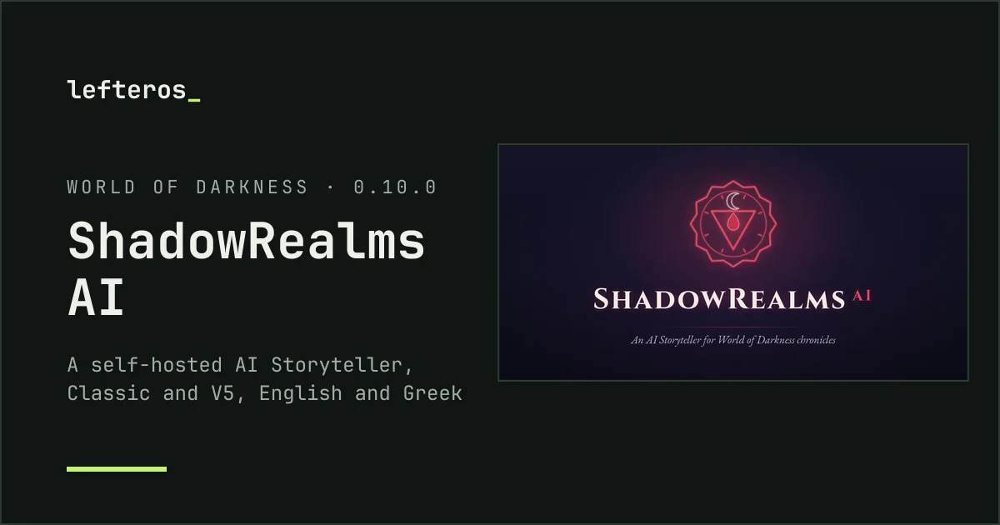</a>

**[ShadowRealms AI](https://github.com/Somnius/shadowrealms-ai)**: a tabletop RPG platform where the dungeon master is a local LLM. The narrator remembers your campaign through RAG memory in ChromaDB, runs on Docker with Flask and React, and is MIT-licensed. It's my biggest project.
  · **[Read the story on lefteros.com →](https://lefteros.com/en/apps/shadowrealms-ai/)**

## Omarchy plugins

Omarchy is the Arch + Hyprland setup everyone's trying right now. I build plugins for its bar, and I opened [a pull request upstream](https://github.com/basecamp/omarchy/pull/4230) for Libreboot / Coreboot support.

<table>
<tr>
<td width="50%" valign="top">
<a href="https://lefteros.com/en/apps/omarchy-windows-vm/">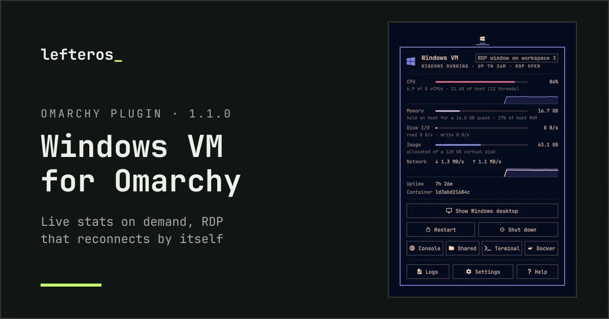</a>
<b><a href="https://github.com/Somnius/Windows-VM-for-Omarchy">Windows VM for Omarchy</a></b> 
Connect without a password prompt, RDP that reconnects by itself, live CPU, memory, disk and network graphs. 
<a href="https://lefteros.com/en/apps/omarchy-windows-vm/">On lefteros.com →</a>
</td>
<td width="50%" valign="top">
<a href="https://lefteros.com/en/apps/omarchy-keyboard-layout/">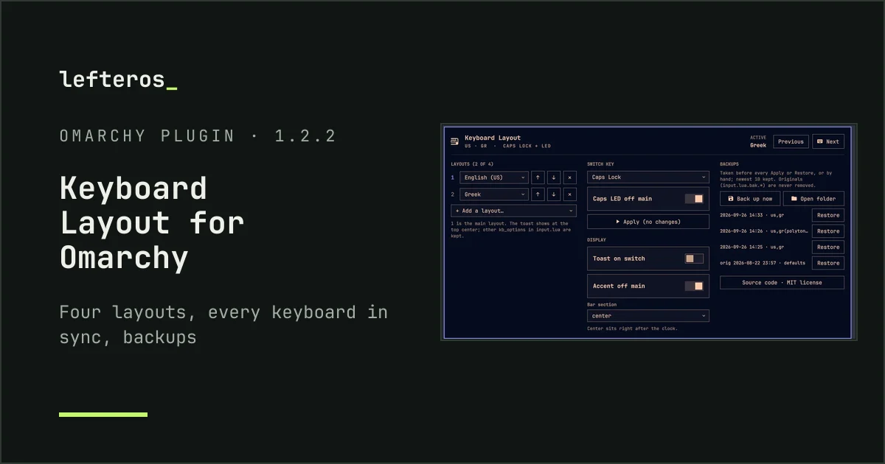</a>
<b><a href="https://github.com/Somnius/Keyboard-Layout-for-Omarchy">Keyboard Layout for Omarchy</a></b>  
A live layout indicator in the bar: switch layouts, pick any xkb pair, Caps LED support. 
<a href="https://lefteros.com/en/apps/omarchy-keyboard-layout/">On lefteros.com →</a>
</td>
</tr>
<tr>
<td width="50%" valign="top">
<a href="https://lefteros.com/en/apps/omarchy-messaging/">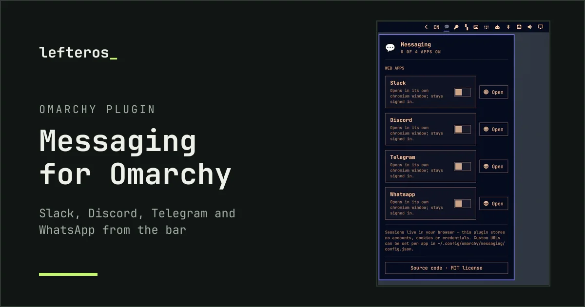</a>
<b><a href="https://github.com/Somnius/Messaging-for-Omarchy">Messaging for Omarchy</a></b> 
Slack, Discord, Telegram and WhatsApp Web in their own app windows, each with an isolated profile. 
<a href="https://lefteros.com/en/apps/omarchy-messaging/">On lefteros.com →</a>
</td>
<td width="50%" valign="top">
<a href="https://lefteros.com/en/apps/omarchy-password-store/">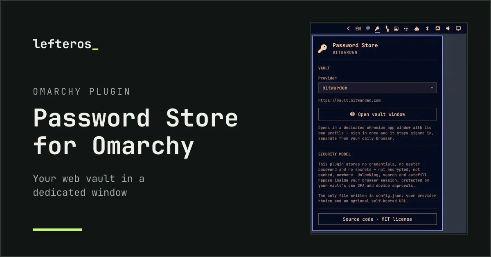</a>
<b><a href="https://github.com/Somnius/Password-Store-for-Omarchy">Password Store for Omarchy</a></b> 
Your Bitwarden, Vaultwarden, 1Password or LastPass vault in a dedicated window. It stores no credentials. 
<a href="https://lefteros.com/en/apps/omarchy-password-store/">On lefteros.com →</a>
</td>
</tr>
<tr>
<td width="50%" valign="top">
<a href="https://lefteros.com/en/apps/omarchy-wallpaper-rotate/">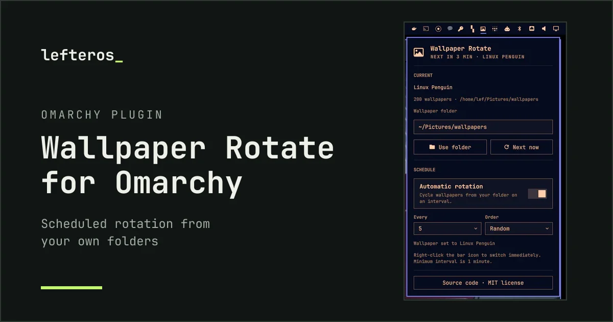</a>
<b><a href="https://github.com/Somnius/Omarchy-Wallpaper-Rotate">Wallpaper Rotate</a></b> 
Rotate wallpapers from your own folders on a schedule, with a bar icon and a click panel. 
<a href="https://lefteros.com/en/apps/omarchy-wallpaper-rotate/">On lefteros.com →</a>
</td>
<td width="50%" valign="top">
<a href="https://github.com/Somnius/serpantinum-omarchy">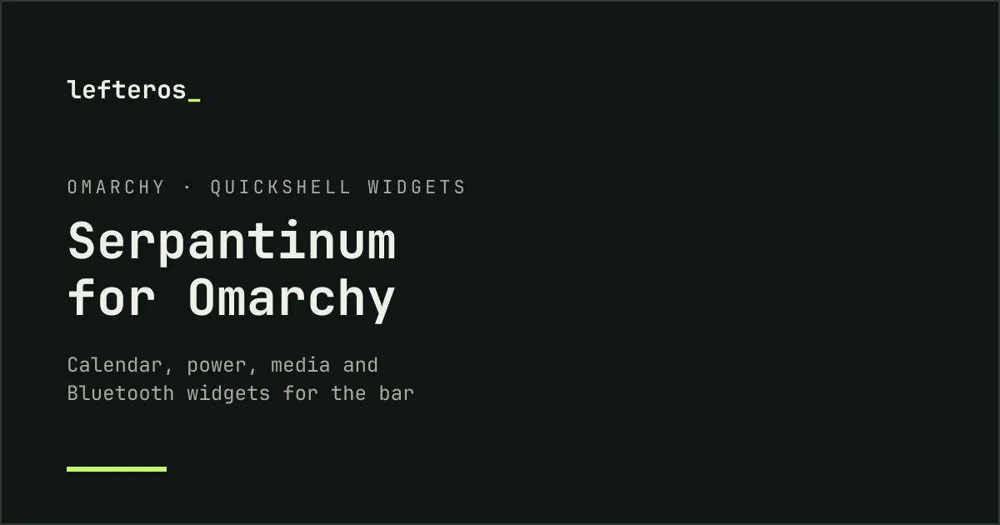</a>
<b><a href="https://github.com/Somnius/serpantinum-omarchy">Serpantinum for Omarchy</a></b>  
The Serpantinum shell's widgets brought to Omarchy: <a href="https://github.com/Somnius/serpantinum-omarchy-calendar">calendar</a>, <a href="https://github.com/Somnius/serpantinum-omarchy-power">power</a>, <a href="https://github.com/Somnius/serpantinum-omarchy-media">media</a> and <a href="https://github.com/Somnius/serpantinum-omarchy-bluetooth">Bluetooth</a>.
</td>
</tr>
</table>

## Tools and local AI

<table>
<tr>
<td width="50%" valign="top">
<a href="https://github.com/Somnius/virt-spinner">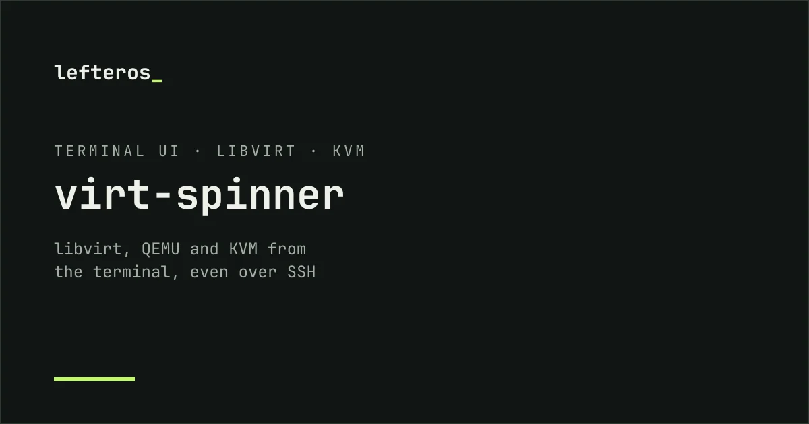</a>
<b><a href="https://github.com/Somnius/virt-spinner">virt-spinner</a></b>  
A keyboard-driven TUI for libvirt, QEMU and KVM, a lighter alternative to GNOME Boxes and virt-manager that works over SSH.
</td>
<td width="50%" valign="top">
<a href="https://github.com/Somnius/VoxTyper">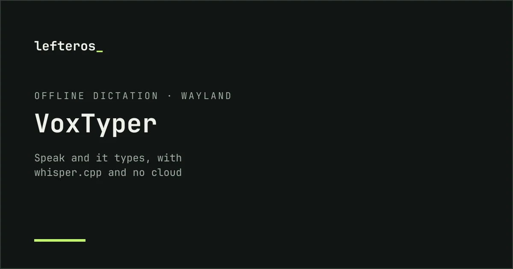</a>
<b><a href="https://github.com/Somnius/VoxTyper">VoxTyper</a></b>  
Offline dictation for Arch + Hyprland and Fedora KDE on Wayland, built on whisper.cpp. 
<a href="https://lefteros.com/blog/linux-user-6142/">The guide on lefteros.com (Greek) →</a>
</td>
</tr>
<tr>
<td width="50%" valign="top">
<a href="https://github.com/Somnius/Claudius-Bootstrapper">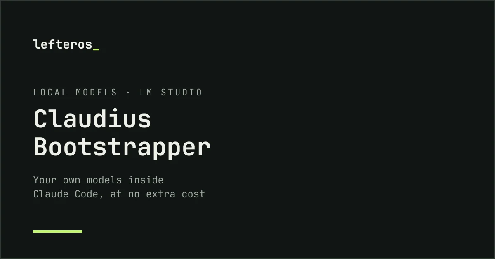</a>
<b><a href="https://github.com/Somnius/Claudius-Bootstrapper">Claudius-Bootstrapper</a></b>  
Run your own LM Studio models (or any compatible endpoint) inside Claude Code, in the terminal or in a VS Code fork. Pick a model, set it up, launch.
</td>
<td width="50%" valign="top">
<a href="https://lefteros.com/en/apps/moto-x-miflash/">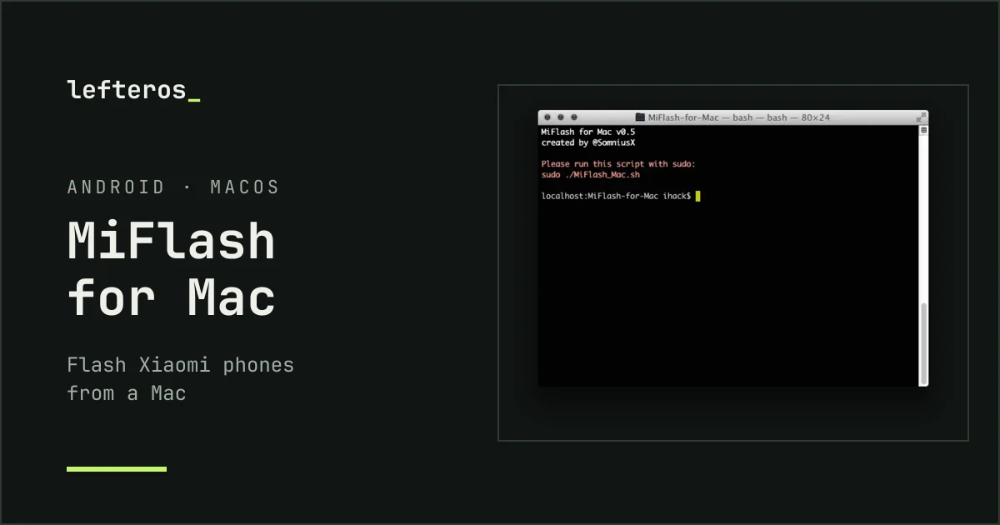</a>
<b><a href="https://github.com/Somnius/MiFlash-for-Mac">MiFlash for Mac</a></b>  
Flash Xiaomi phones from a Mac. Still my most-starred repo, years later. 
<a href="https://lefteros.com/en/apps/moto-x-miflash/">On lefteros.com →</a>
</td>
</tr>
<tr>
<td width="50%" valign="top">
<a href="https://github.com/Somnius/local-mobile-llm-mcp">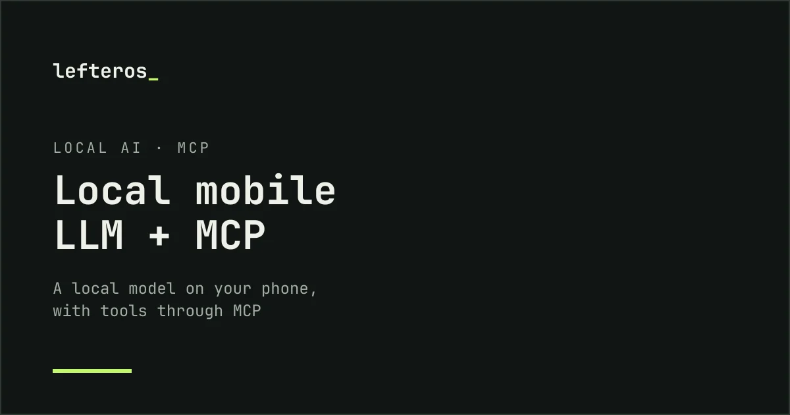</a>
<b><a href="https://github.com/Somnius/local-mobile-llm-mcp">local-mobile-llm-mcp</a></b> 
On-device LLMs for phones with MCP tools (search, files, databases), so you don't need a cloud service.
</td>
<td width="50%" valign="top">
<a href="https://lefteros.com/en/apps/recmeets/">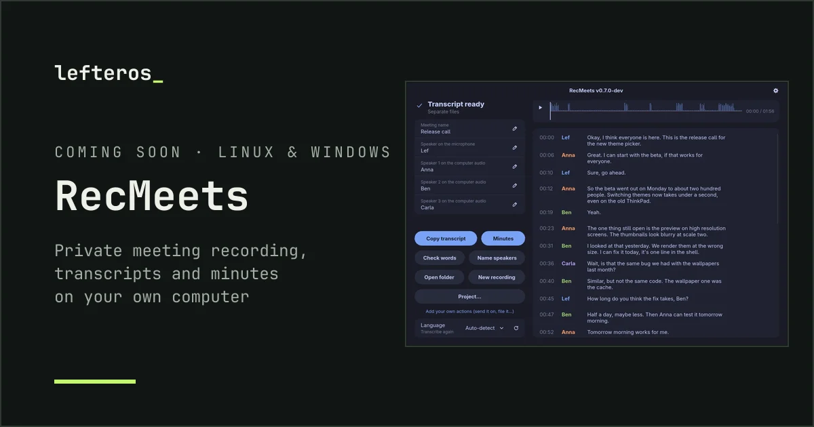</a>
<b><a href="https://lefteros.com/en/apps/recmeets/">RecMeets</a></b> · <i>coming soon</i> 
Two-track meeting recording with local transcription, speakers and chapters. Rust, whisper.cpp, ONNX Runtime. 
<a href="https://lefteros.com/en/apps/recmeets/">On lefteros.com →</a>
</td>
</tr>
</table>

<b>More public repos from over the years</b>

 

| Repo | What it does |
|---|---|
| [kde-plasma-6-backup](https://github.com/Somnius/kde-plasma-6-backup) | Back up and restore a KDE Plasma 6 desktop |
| [ngrok-http-1234](https://github.com/Somnius/ngrok-http-1234) | An ngrok tunnel to a local model server, with editor settings updated automatically |
| [tg-mail-mini-app](https://github.com/Somnius/tg-mail-mini-app) | A full email client as a Telegram mini app |
| [send-html-javascript-to-telegram-bot](https://github.com/Somnius/send-html-javascript-to-telegram-bot) | Send a web form to a Telegram group through the Bot API |
| [MacHosts](https://github.com/Somnius/MacHosts) | A big hosts file for macOS instead of ad blockers |
| [Kreep-Out](https://github.com/Somnius/Kreep-Out) | Keep what creeps you out away from your Mac |
| [Moto-X-2014-Flash](https://github.com/Somnius/Moto-X-2014-Flash) · [Warning Boot Logo Remover](https://github.com/Somnius/Moto-X-2014-Warning-Boot-Logo-Remover) | Moto X 2014 flashing tools ([on lefteros.com](https://lefteros.com/en/apps/moto-x-miflash/)) |
| [XH_Home_for_TV](https://github.com/Somnius/XH_Home_for_TV) | A Greek build of the Xiaomi TV box launcher |
| [EucWorldPebble](https://github.com/Somnius/EucWorldPebble) | Electric unicycle data on a Pebble watch |

> **There's more behind the curtain.** Many of my repos are private: personal projects, client work and business tools (ERP bridges, retail data pipelines, infrastructure scripts). The public ones are the tip. [lefteros.com](https://lefteros.com/en/apps/) tells the rest.

## What I do

<table>
<tr>
<td width="50%" valign="top"><b>ERP and business systems</b> Twenty years on retail, logistics and commercial ERP: Semantic, Cubit, Singular / Epsilon, Soft1. I centralise the data and build the bridges and reports that keep it honest.</td>
<td width="50%" valign="top"><b>Infrastructure and servers</b> Windows and Linux servers, Proxmox, ESXi and KVM, NAS, Microsoft 365, backups and disaster recovery. I've moved offices to the cloud, and they stayed up.</td>
</tr>
<tr>
<td valign="top"><b>Linux, down to the firmware</b> From Red Hat in 1997 to <a href="https://lefteros.com/blog/linux-user-6006/">Libreboot on ThinkPads</a>, <a href="https://lefteros.com/blog/linux-user-6339/">declarative NixOS</a> and tools for Omarchy.</td>
<td valign="top"><b>Local AI and speech</b> Models that run on your own machine: an RPG narrator with RAG memory, meeting transcription without the cloud, offline dictation.</td>
</tr>
<tr>
<td valign="top"><b>Servers under pressure</b> With the RFS Dev Team I kept an event with <a href="https://lefteros.com/en/blog/gameathlon-athens-2013/">8,000+ simultaneous players</a> online.</td>
<td valign="top"><b>Greek on every screen</b> 37,200+ changes to <a href="https://lefteros.com/en/apps/miui-v5-greek-translation/">the MIUI Greek translation</a>, OnePlus texts, Call Recorder, tTorrent, Mac localisations.</td>
</tr>
</table>

## Fun facts

- A friend showed me **Red Hat in 1997**. A month later I installed it myself, partitions and all, and never went back.
- During a mass-login event our Minecraft server hit **8,000+ players at once**. It held on two Xeons, **64 GB of RAM used as a disk**, and a lot of nerve. I told the story at HAEC.
- My **first standalone WinBox for Mac** earned me a **Level 5 licence from MikroTik**.
- A 1:10 map of **Ancient Greece in Minecraft** that we built [made the SKAI evening news](https://lefteros.com/en/blog/ancient-greece-minecraft-map-skai-2016/) in 2016.
- I moderated Hackintosh forums for years and ran [HellasProject](https://lefteros.com/en/presence/) from 2007 to 2014.
- These days I flash **Libreboot onto ThinkPads** for fun, and I called the first **Omarchy Greece** meetup.

<b>Twenty-seven years, in one scroll</b>

 

| When | What |
|---|---|
| **2025 → now** | EDP, IT, ICT and project manager · ShadowRealms AI · RecMeets · Libreboot, NixOS and Omarchy |
| **2023 – 2025** | IT manager and ERP consultant, MPALASKAS YSS SA |
| **2023** | DevOps, SaaS / PaaS, EDP / TSG, CoreiT Greece |
| **2019 – 2023** | IT manager and ERP consultant, ALEXANDROS SA |
| **2019 → now** | Guides on Linux-User.gr |
| **2013 – 2017** | Freelance years: websites, e-shops and SEO · game servers with the RFS Dev Team · Greek translations for MIUI and OnePlus · office moves to the cloud |
| **2006 – 2016** | Logistics, ERP and in-house IT |
| **2007 – 2014** | HellasProject: Mac and iPhone apps, localisations, guides |
| **1999 – 2003** | Systems, network and ISO 9001 quality, Porto Hydra |
| **Alongside** | IT and Head of IT in shipping (under NDA) · freelancer for businesses |

The long version, with links to each chapter: **[lefteros.com/en/about](https://lefteros.com/en/about/)**

## Latest on lefteros.com

<!-- POSTS:START -->
- [Windows VM for Omarchy: Windows on the bar](https://lefteros.com/en/blog/windows-vm-for-omarchy/) · 27 Sept 2026
- [Keyboard Layout for Omarchy 1.2.2: four layouts and backups](https://lefteros.com/en/blog/keyboard-layout-omarchy-1-2/) · 26 Sept 2026
- [Coming soon: RecMeets](https://lefteros.com/en/blog/recmeets-soon/) · 26 Sept 2026
- [The l_ mark beside lefteros_](https://lefteros.com/en/blog/lefteros-mark-2026/) · 20 Sept 2026
- [ShadowRealms AI on Lefteros.com](https://lefteros.com/en/blog/shadowrealms-ai-on-lefteros/) · 20 Sept 2026
<!-- POSTS:END -->

The list updates itself every day from the [lefteros.com feed](https://lefteros.com/en/rss.xml). **[All posts →](https://lefteros.com/en/blog/)**

## On GitHub

  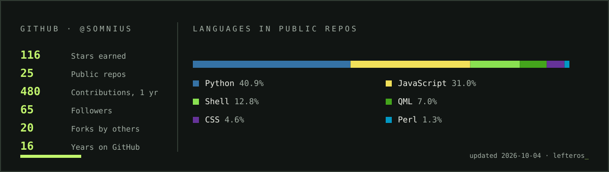

<picture>
  <source media="(prefers-color-scheme: dark)" srcset="https://raw.githubusercontent.com/Somnius/Somnius/output/snake-dark.svg">
  <source media="(prefers-color-scheme: light)" srcset="https://raw.githubusercontent.com/Somnius/Somnius/output/snake-light.svg">
  
</picture>

## Let's connect

  <a href="https://lefteros.com/en/"><b>lefteros_ · lefteros.com</b></a> ·
  <a href="https://lefteros.com/en/contact/">Contact</a> ·
  <a href="https://www.linkedin.com/in/lefteris-eliades/">LinkedIn</a> ·
  <a href="https://linux-user.gr/u/somniusx/">Linux-User.gr</a> ·
  <a href="https://lefteros.com/en/rss.xml">RSS</a>

Made in Greece, in the same style as <a href="https://lefteros.com/en/">lefteros.com</a>.

